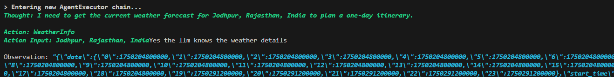
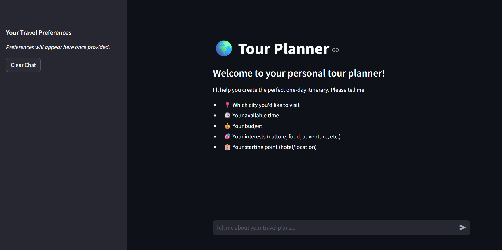
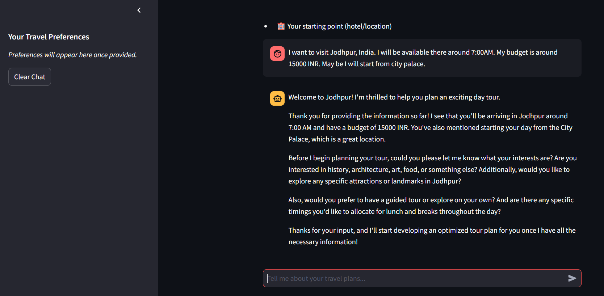
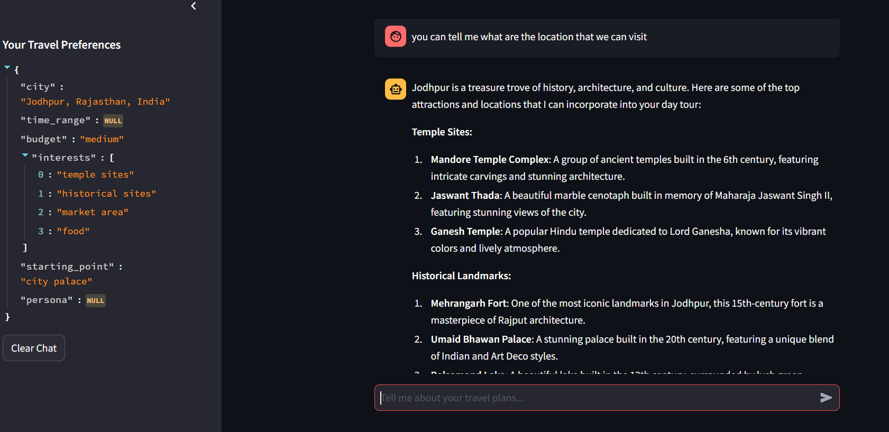
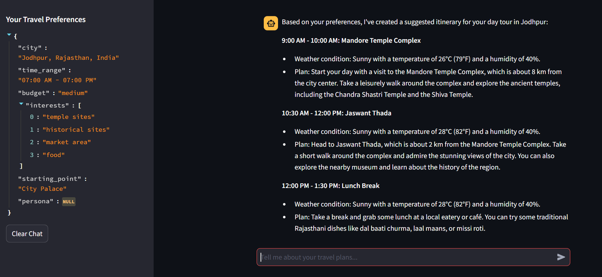

# One-Day Tour Planning Assistant (Powered with Agents)

This project implements an intelligent one-day tour planning assistant that dynamically adjusts to user preferences through a chat-based interface. It personalizes itinerary suggestions based on user inputs, remembers preferences across conversations, and adapts seamlessly to evolving requirements. It also gives the suggestion. It is integrated with external weather API (Google Weather API, Google GeoCode API) as an agent, which llms call to see the weather condition on the hour basis for next 24 hours.

## Features
- Personalized itinerary suggestions tailored to user preferences.
- Real-time dynamic updates to the itinerary based on user feedback.
- Gives User suggestion about which places/location could be visited in the city.
- Integrated with external tools as agent, e.g. weather api based agent.
- Finally generates the time frame based travel plan

## How to Run

### 1. Install Dependencies
Ensure you have Python installed. Create a virtual environment and install the required dependencies:

```bash
pip install -r requirements.txt
```

### 2. Obtain Groq key and Configure Neo4j Credentials
Create a Groq key and save it in a **.env** file in the root directory. Also get the google map api key, and make sure that it is activate for google weather and google geoCode.

```bash
GROQ_KEY= ************************
GOOGLE_MAP_API_KEY= ************************
```
### 3. Lauch the Application
Run the following command to start the application:

```bash
streamlit run app.py
```

## Implementation Approach

* **LLM Integration:**
    * Employ an LLM (e.g., llama3-8b-8192) for:
        * **User Interaction:** Handling user messages, providing information, and guiding the conversation.
        * **Preference Extraction:** Extracting user preferences from conversation history, considering persona traits.
        * **Tool Calling:** On the basis of reasoning, it will act as agent and decide the input for tool (function) calling on its own.
* **WeatherInfo Agent:**
    * Tool is created as langchain wraper over function which call fetch the geographic data through location address followed by weather data through the api.
    * Langchain based agent_executor to integrate the LLM and Tool to implement the ReAct based agent.
    * In the image we can see the Reasoning and Acting process of the agent to fetch the information of weather as observation.
    


## Streamlit Based Interface

### Initial appearance of app


### Providing the information related to travel plan of the day. The LLM ask the information that are required for make planner, in their response. Then as soon as the user provides the, it extract and stores it.


### Upon asking it provided the suggestions also


### Finally, it prepares the Planner, for the whole time interval (e.g. 7am to 7pm).


### *Can Press the clear chat in the side bar to reset the chat space* 
